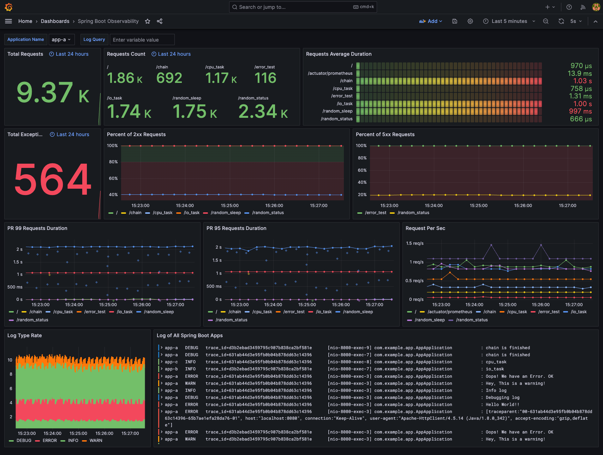
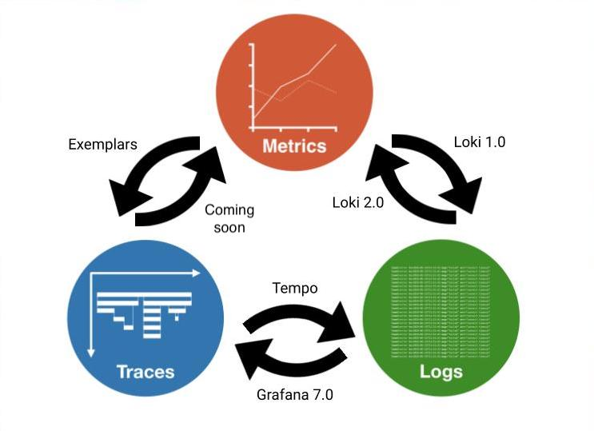

# LGTM-demo

> - Original project: [Spring Boot with Observability](https://github.com/blueswen/spring-boot-observability?tab=readme-ov-file)
> - Original dashboard is also available on [Grafana Dashboards](https://grafana.com/grafana/dashboards/17175).



Observe the Spring Boot application with three pillars of observability on [Grafana](https://github.com/grafana/grafana):

1. Traces with [Tempo](https://github.com/grafana/tempo) and [OpenTelemetry Instrumentation for Java](https://github.com/open-telemetry/opentelemetry-java-instrumentation)
2. Metrics with [Prometheus](https://prometheus.io/), [Spring Boot Actuator](https://docs.spring.io/spring-boot/docs/current/actuator-api/htmlsingle/), and [Micrometer](https://micrometer.io/)
3. Logs with [Loki](https://github.com/grafana/loki) and [Logback](https://logback.qos.ch/)


This demo project is a Spring Boot version of [FastAPI with Observability](https://github.com/blueswen/fastapi-observability) and is also inspired by [Cloud Observability with Grafana and Spring Boot](https://github.com/qaware/cloud-observability-grafana-spring-boot).


## Quick Start

1. Start all services with docker-compose

   ```bash
   docker-compose up -d
   ```

2. Send requests with [siege](https://linux.die.net/man/1/siege) and curl to the Spring Boot app

   ```bash
   bash request-script.sh
   bash trace.sh
   ```

   Or you can send requests with [k6](https://k6.io/):

   ```bash
   k6 run --vus 3 --duration 300s k6-script.js
   ```

   Or send requests from applications' Swagger UI:

    - app-a: [http://localhost:8080/swagger-ui/index.html](http://localhost:8080/swagger-ui/index.html)
    - app-b: [http://localhost:8081/swagger-ui/index.html](http://localhost:8081/swagger-ui/index.html)
    - app-c: [http://localhost:8082/swagger-ui/index.html](http://localhost:8082/swagger-ui/index.html)

3. Check predefined dashboard ```Spring Boot Observability``` on Grafana [http://localhost:3000/](http://localhost:3000/) and login with default account ```admin``` and password ```admin```


## Explore with Grafana

Grafana provides a great solution, which could observe specific actions in service between traces, metrics, and logs through trace ID and exemplar.

<!--  -->

Image Source: [Grafana](https://grafana.com/blog/2021/03/31/intro-to-exemplars-which-enable-grafana-tempos-distributed-tracing-at-massive-scale/)

### Metrics to Traces

Get Trace ID from an exemplar in metrics, then query in Tempo.

Query with ```histogram_quantile(.99,sum(rate(http_server_requests_seconds_bucket{application="app-a", uri!="/actuator/prometheus"}[1m])) by(uri, le))``` and turn on Exemplars in options.


### Traces to Logs

Get Trace ID and tags (here is `compose.service`) defined in Tempo data source from span, then query with Loki.


### Logs to Traces

Get Trace ID from log (regex defined in Loki data source), then query in Tempo.


